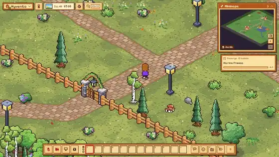
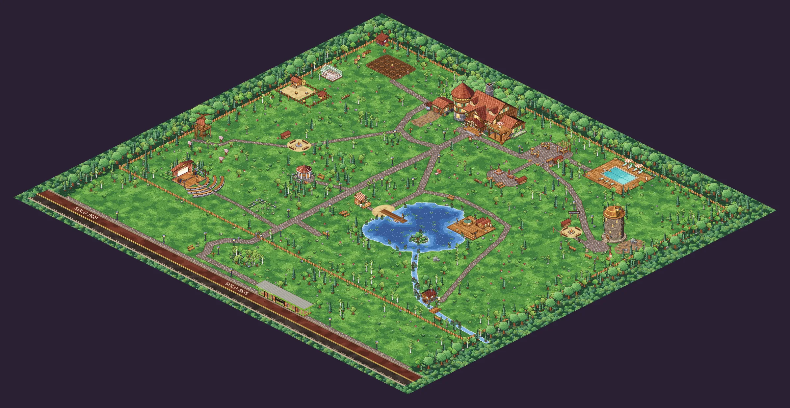
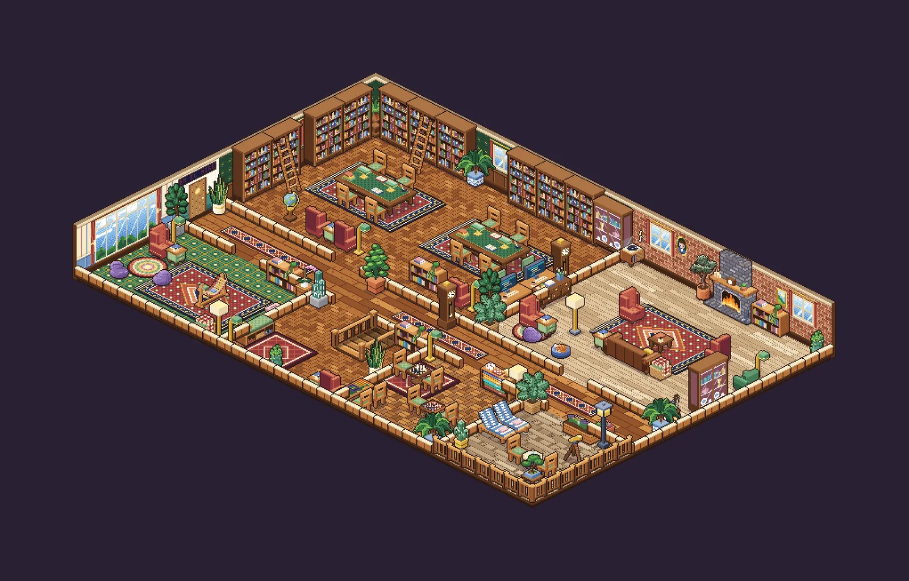
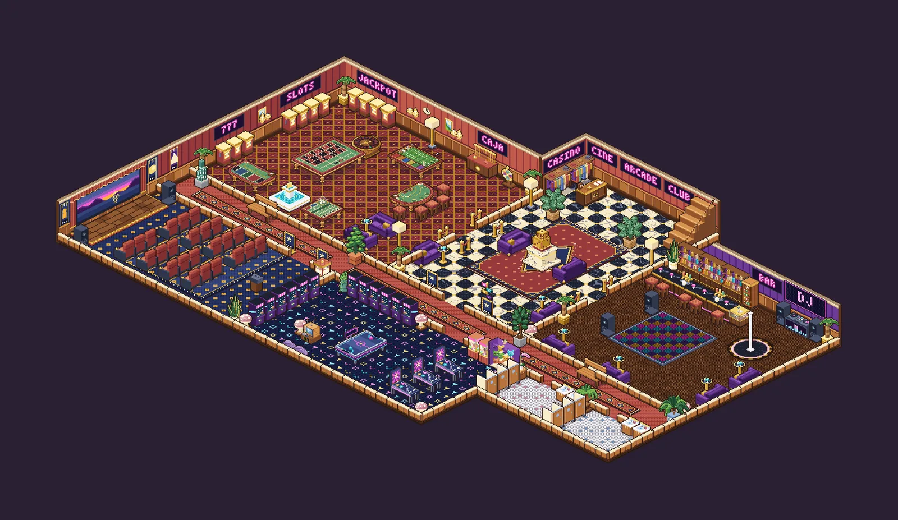
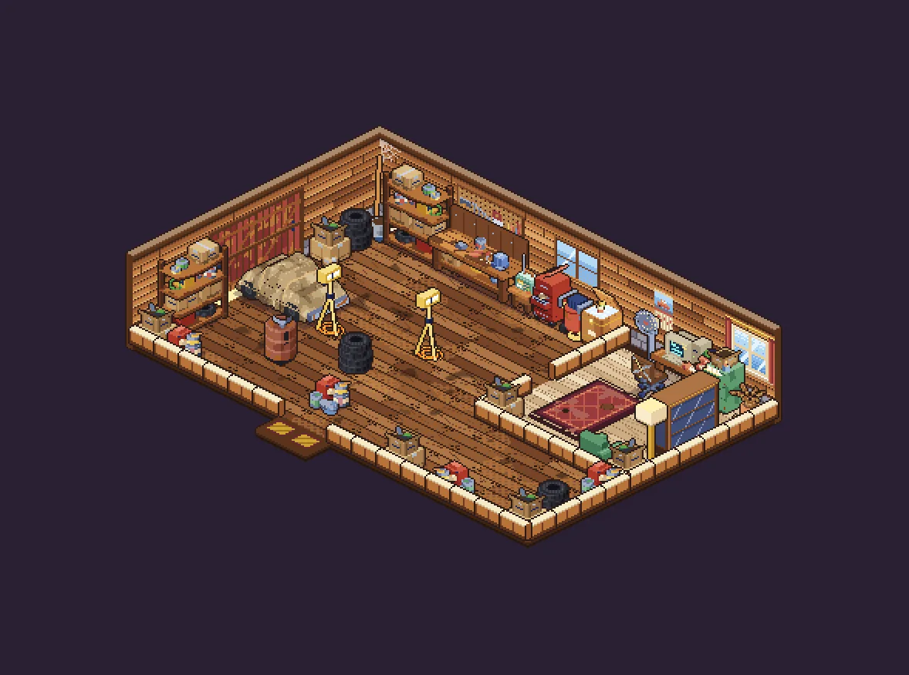
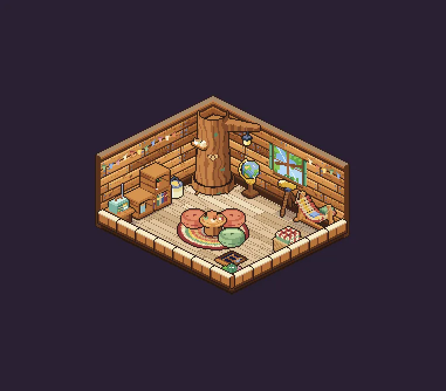
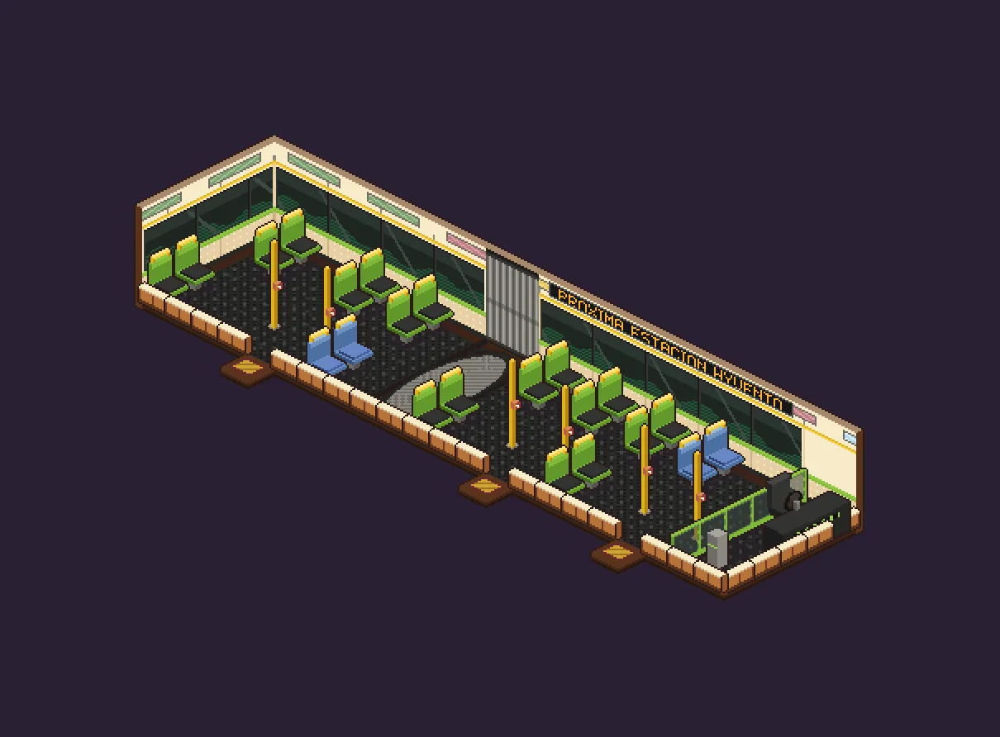
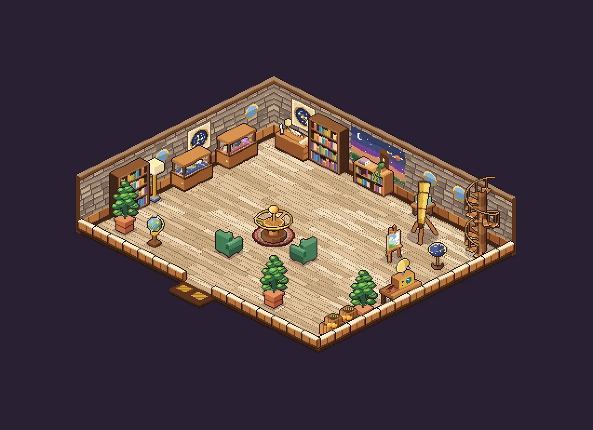
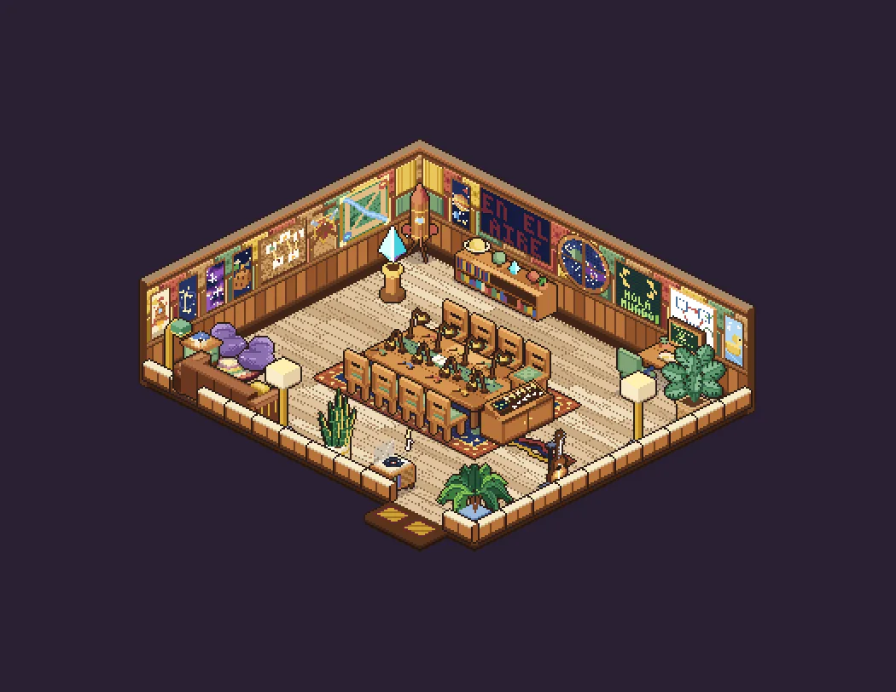
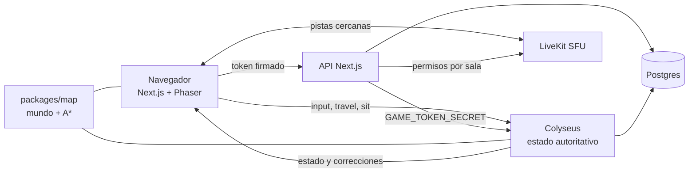

<div align="center">


Oficina virtual isométrica en pixel-art para equipos remotos: caminas por una cabaña, te acercas a alguien y empiezas a hablar.

[](https://nextjs.org/)
[](https://react.dev/)
[](https://www.typescriptlang.org/)
[](https://phaser.io/)
[](https://colyseus.io/)
[](https://livekit.io/)
[](https://tailwindcss.com/)
[](https://www.prisma.io/)
[](https://nodejs.org/)

<br />

[Propósito](#propósito) · [Recorrido](#recorrido) · [Stack](#stack) · [Funcionamiento](#funcionamiento) · [Desarrollo](#desarrollo-local) · [Deploy](#deploy)

</div>

---



<sub>Un recorrido real por el juego: lago y puesto de pesca, fogata, escenario, la casa, cafetería, tienda, oficinas del piso 2 y el casino y el club del sótano.</sub>

Lumbre convierte la oficina remota en un lugar al que se entra. Cada persona tiene un chibi personalizable, una oficina propia que decora con muebles comprados con puntos y un PC con su propio sistema operativo. La voz y el video funcionan **por proximidad**: si te acercas a alguien, lo escuchas; si entras a una sala, solo te escucha quien está adentro. Todo es multijugador en tiempo real con un servidor autoritativo, y **todo el arte se genera por código**: no hay un solo PNG dibujado a mano en el repo.

## Propósito

Las videollamadas de agenda no se parecen a trabajar juntos: para hablar con alguien hay que citarlo, y la conversación de pasillo, la que resuelve dudas y crea equipo, desaparece. Lumbre existe para devolverla a los equipos remotos:

- **Presencia, no reuniones.** Ves quién está, dónde y qué hace; te acercas y hablas, sin agendar nada.
- **Un lugar propio.** Oficina, personaje y decoración hacen que el equipo tenga un sitio con identidad, no una lista de contactos.
- **Vida más allá del trabajo.** Cafetería, casino, club, piscina, huerto, pesca o un pomodoro en la casa del árbol dan motivos para pasar por ahí y conocerse.
- **Gratis de operar.** Cabe en planes gratuitos y no depende de APIs de IA de pago.

Hoy es la cabaña del equipo de [Hyvento](https://hyvento.co); la idea de abrirla a cualquier equipo está en [`docs/plan-equipos.md`](docs/plan-equipos.md).

## Recorrido

<table>
  <tr>
    <td width="50%"><br /><sub><b>Cafetería</b>: se pide en la barra con puntos y lo pedido queda en la mano del personaje.</sub></td>
    <td width="50%"><br /><sub><b>Casino</b> en el sótano: ruleta y blackjack con mesas autoritativas; se apuesta solo lo que alcanza el saldo.</sub></td>
  </tr>
  <tr>
    <td width="50%"><br /><sub><b>Club</b>: pista de baile, barra y cabina de DJ, con letreros de neón generados letra por letra.</sub></td>
    <td width="50%"><br /><sub><b>Piso 2</b>: oficinas personales con placa, puerta que se cierra y toque para pedir pasar.</sub></td>
  </tr>
</table>

<details>
<summary><b>Los niveles completos, dibujados por el motor pixel</b></summary>
<br />

**Jardín**, de día y de noche: casa, escenario, piscina, granja, lago con tina y sauna, observatorio, casa del árbol y la parada del Megabús.




**Planta baja, piso 2 y piso 3**




**Sótano** (casino, club y cine)



**Niveles pequeños**

<table>
  <tr>
    <td width="33%"><br /><sub><b>Garaje</b>: taller y oficina extra.</sub></td>
    <td width="33%"><br /><sub><b>Casa del árbol</b>: cupo de 3 y pomodoro compartido.</sub></td>
    <td width="33%"><br /><sub><b>Megabús</b>: por dentro, con viaje de 30 s.</sub></td>
  </tr>
  <tr>
    <td width="33%"><br /><sub><b>Observatorio</b>: telescopio, orrery y fogata de malvaviscos.</sub></td>
    <td width="33%"><br /><sub><b>Estudio</b>: se graba solo si todos aceptan.</sub></td>
    <td width="33%"></td>
  </tr>
</table>

Cada imagen sale de `pnpm --filter @hyvento/map render <nivel> salida.png [noche]`, sin abrir el juego.
</details>

### Qué hay adentro

| | |
| --- | --- |
| **Proximidad** | Chat y video por cercanía; las salas cerradas aíslan el audio. Suscripción selectiva en el SFU: solo recibes las pistas de quien tienes cerca. |
| **Presencia** | Disponible, ocupado, no molestar y ausente (automático por inactividad); "En reunión" lo calcula el servidor. Mascotas que te siguen entre niveles y fotos con polaroid. |
| **Oficinas** | Una por persona, con placa, estado, puerta que se cierra y toque de puerta. Decoración en vivo que sobrevive a un rediseño del plano. |
| **Hyvento OS** | Un PC dentro del juego con escritorio, ventanas y apps: notas estilo Notion (TipTap), papelera, calendario y pintura de cuadros que se cuelgan en la oficina; fondos de escritorio a elección. |
| **Reuniones** | Escenario con anfiteatro (habla uno, oyen todos, mano levantada y ovación), estudio de grabación con consentimiento de todos y casa del árbol con pomodoro compartido. |
| **Progreso** | Encargos, oficios con nivel (pesca, huerta, cocina, social y exploración), el capítulo 1 de la historia con Doña Aurora y el standup diario del tablón. |
| **Economía** | Puntos por presencia y reuniones, buzón con racha diaria, tablón de misiones y ranking semanal. Cada movimiento queda en un libro contable. |
| **Tienda, vestidor y mochila** | Muebles con inventario, ropa gratis y una mochila estilo Stardew con barra de acceso rápido. El personaje se arma por piezas y se dibuja en el navegador. |
| **Sótano** | Casino, club con propinas al tubo y cine. Azar con `crypto.randomInt` y apuestas en transacciones que bloquean la fila del usuario. |
| **Afuera** | Jardín con huerto, granja (gallinero, molino y parrilla), piscina, tina caliente y sauna, pesca con minijuego y puesto de Don Evelio, observatorio, fogata y un bosque infinito que se repite más allá del borde. |
| **Megabús** | Un bus con horario que pasa por la estación, con viaje, puertas y pantalla de recorrido; se puede llegar a la cabaña en él. |
| **Mundo vivo** | Reloj del juego (1 día = 1 hora real), clima, estaciones, noche y NPC con frases colombianas. Logros, insignias y un diario de exploración. |
| **Juegos** | Ajedrez y damas con reloj, arcade y minijuegos de mesa. |
| **Acciones rápidas** | Paleta Ctrl+K para llamar, saludar, seguir o anunciar, permisos por persona que da el admin y avisos de GitHub en el chat global. |
| **Editor de la casa** | Los admins mueven, giran, quitan y agregan muebles en cualquier nivel; se guarda como diferencia sobre el plano. |

## Stack

| Capa | Tecnología | Uso |
| --- | --- | --- |
| Web | Next.js 15 App Router, React 19, TypeScript strict | Login, perfil, cabaña, `/admin` y API |
| Juego | Phaser 3.90, proyección isométrica propia | Render de niveles, chibis, luces, clima y estaciones |
| UI | Tailwind CSS v4, zustand, Pixelify Sans | HUD "cozy" con sombras sólidas y esquinas rectas |
| Editor | TipTap 3 | Notas de Hyvento OS |
| Multijugador | Colyseus 0.16 (`@colyseus/schema` 3) | Estado autoritativo: movimiento, paredes, asientos, portales, casino, bus, granja, escenario y más |
| Medios | LiveKit (WebRTC SFU), cargado aparte del bundle | Voz, video y pantalla compartida por proximidad, con permisos en el servidor |
| Mundo | `packages/map` | Niveles, catálogo de muebles, colisión, A* y el motor pixel |
| Contratos | `packages/shared`, Zod | Protocolo, reglas de proximidad, puntos, tienda y personajes: iguales en cliente y servidor |
| Datos | Prisma 6 + Postgres (16 en local, Neon en producción) | Usuarios, notas, inventario, decoración y libro de puntos |
| Auth | Supabase Auth (Google), solo por invitación; usuarios en Neon | Admins por correo e invitaciones desde `/admin` |
| Calidad | Vitest 3, Playwright, Turborepo, GitHub Actions (Node 22, pnpm 10) | Typecheck y tests en cada PR; pruebas e2e con `pnpm --filter @hyvento/web e2e` |
| Infra | Vercel, Render, Neon, LiveKit Cloud; Docker en local | Todo en planes gratis |

## Funcionamiento



- **Un solo mundo, dos lados.** El mapa vive en código (`packages/map/src/world`) y lo usan el servidor y el cliente: la colisión que valida el servidor es la misma que anticipa el navegador.
- **El cliente anticipa, el servidor decide.** Moverse, sentarse, cambiar de nivel o entrar a una oficina cerrada se valida en `apps/server` con `canWalkBetween` sobre los bordes de pared. Toda regla nueva lleva test.
- **Coordenadas.** El juego usa píxeles de mundo con tiles de 32; el arte, tiles de 16. La vista isométrica es solo una proyección en el cliente.
- **Arte procedural.** Rampas de color, cajas isométricas con sombreado por cara, contornos y luces. Cada mueble se dibuja mirando a `+x` y los otros lados salen por espejo. Un test exige que todo tipo del catálogo tenga dibujo.
- **Puntos con libro contable.** El saldo solo cambia con `awardPoints` o `spendPoints`, que escriben el movimiento, aplican topes diarios y actualizan la caché del saldo.

## Desarrollo local

### Requisitos

- Node 22+ y pnpm 10 (`npm i -g pnpm@10`).
- Docker Desktop (Postgres y LiveKit en modo dev).

### Instalación

```bash
pnpm install
cp .env.example .env
pnpm infra:up                       # Postgres + LiveKit
pnpm --filter @hyvento/db migrate   # esquema en la base local
pnpm dev                            # web :3000 + servidor de juego :2567
```

En desarrollo el login muestra **"Entrar de prueba"**: pones un nombre y entras sin Google. Para varias personas, otra ventana en incógnito con otro nombre.

### Comandos

```bash
pnpm typecheck && pnpm test                    # lo mismo que corre el CI
pnpm --filter @hyvento/map render jardin a.png # dibuja un nivel a PNG ("noche" como 3er argumento)
pnpm --filter @hyvento/web build               # build de producción
```

## Estructura

```text
apps/
  web/        Next.js + Phaser: escena, HUD, Hyvento OS, API y /admin
  server/     Colyseus: sala y reglas por sistema (bus, casino, granja, escenario…) y tests
packages/
  map/        Mundo en código, colisión, A* y motor pixel (src/art)
  shared/     Protocolo (zod), Look del personaje, reglas de puntos, tienda y casino
  db/         Prisma, migraciones y libro de puntos
docs/         Planes (cabaña, rediseño, estructuras, casas, equipos), despliegue e imágenes
```

## Deploy

Todo cabe en planes gratis: **Vercel** (web), **Render** (servidor de juego, `render.yaml`), **Neon** (Postgres) y **LiveKit Cloud** (voz y video, opcional). El paso a paso está en [`docs/despliegue.md`](docs/despliegue.md).

> Ni Vercel ni Render corren migraciones: se aplican en Neon **antes** de que el código llegue a `main`.

## La marca

**Lumbre** es el nombre público (lumbre = la luz de la fogata: el equipo se junta como alrededor del fuego). **Hyvento** es el equipo que la usa: adentro de Lumbre está "la cabaña de Hyvento". Por eso lo interno conserva el nombre (paquetes `@hyvento/*`, ids, base de datos y el botón "Hyvento" del HUD).

- **Portada** (`/` sin sesión): la presentación pública, con la casa del jardín dibujada por el motor del juego y gente caminando (`apps/web/src/components/lumbre/`). Con sesión, `/` entra directo a la cabaña.
- **Login** (`/login`): Google por invitación y, en desarrollo, "Entrar de prueba".
- **Identidad**: la llamita pixel, las letras pixel y el eslogan están en `components/lumbre/marca.ts`. De ahí salen el logotipo, el favicon (`app/icon.tsx`, con respaldo PNG en `app/icon2.tsx`), el ícono de iOS (`app/apple-icon.tsx`), la imagen al compartir el enlace (`app/opengraph-image.tsx`) y el banner de este README (`pnpm --filter @hyvento/web banner` lo vuelve a dibujar).

## Documentación

- [Plan de la cabaña](docs/plan-cabana.md): salas y fases.
- [Plan del rediseño](docs/plan-rediseno.md): el plano actual.
- [Plan de estructuras](docs/plan-estructuras.md): las construcciones del jardín.
- [La casa de cada persona](docs/plan-casas.md) y [Lumbre para cualquier equipo](docs/plan-equipos.md): ideas documentadas, aún sin desarrollar.
- [Despliegue gratis](docs/despliegue.md).
- [Onboarding](ONBOARDING.md) y [convenciones](CLAUDE.md).

<div align="center">
<br />
<sub>Hecho en Pereira, Colombia · por <a href="https://juanordonezdev.hyvento.co/">Juan José Pantoja</a> para <a href="https://hyvento.co">Hyvento</a></sub>
</div>
