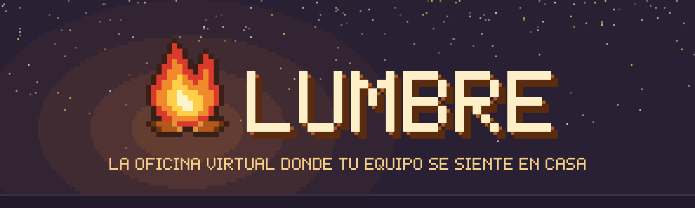
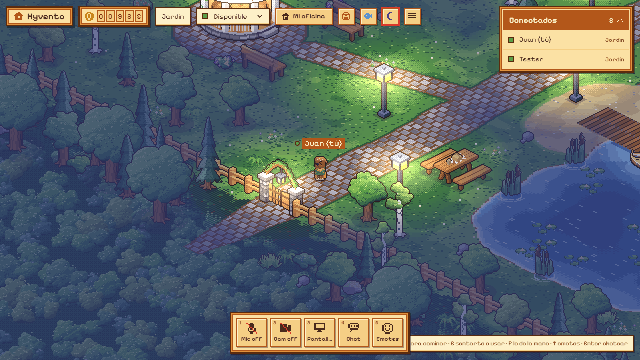
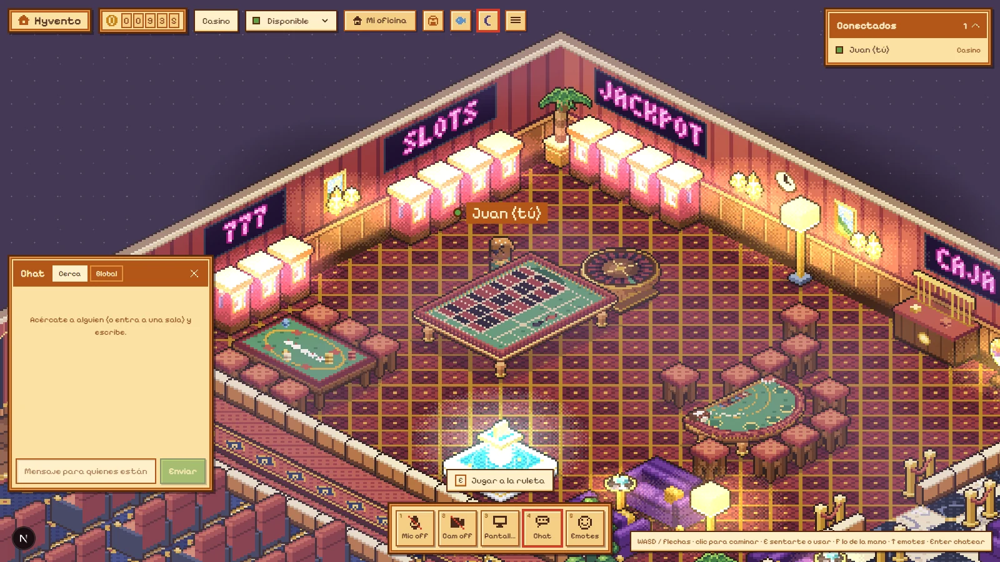
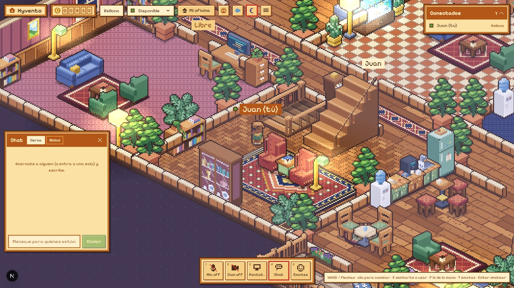
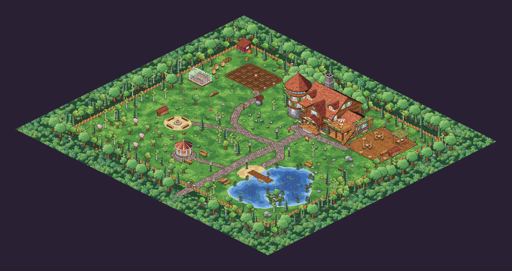
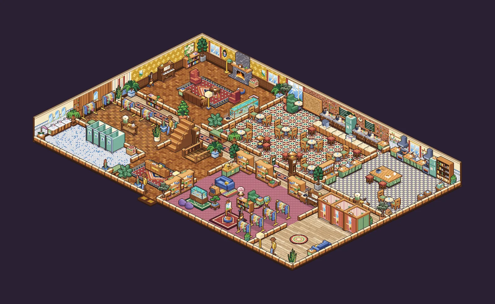
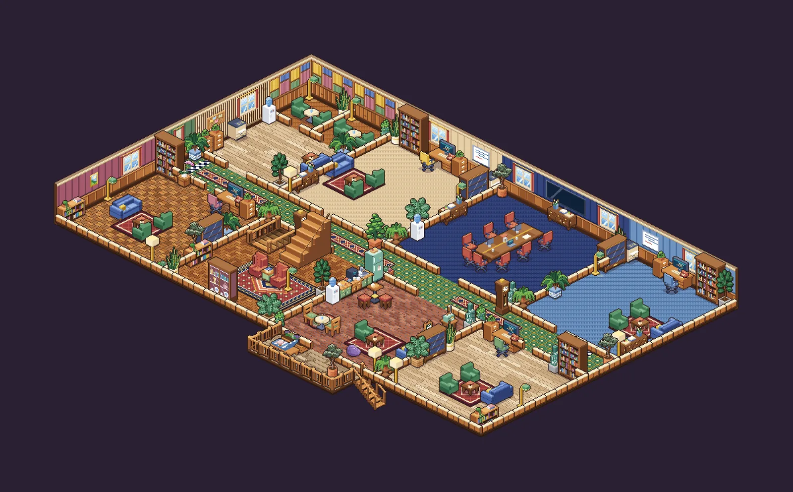
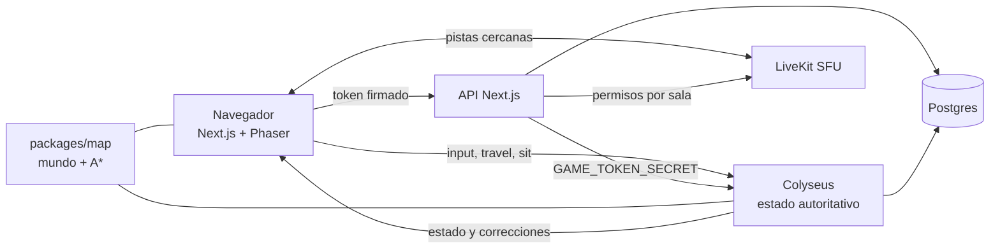

<div align="center">



Oficina virtual isométrica en pixel-art para equipos remotos: caminas por una cabaña, te acercas a alguien y empiezas a hablar.

[](https://nextjs.org/)
[](https://react.dev/)
[](https://www.typescriptlang.org/)
[](https://phaser.io/)
[](https://colyseus.io/)
[](https://livekit.io/)
[](https://www.prisma.io/)

<br />

[Recorrido](#recorrido) · [Stack](#stack) · [Funcionamiento](#funcionamiento) · [Desarrollo](#desarrollo-local) · [Deploy](#deploy)

</div>

---



Lumbre convierte la oficina remota en un lugar al que se entra. Cada persona tiene un chibi personalizable, una oficina propia que decora con muebles comprados con puntos y un PC con su propio sistema operativo. La voz y el video funcionan **por proximidad**: si te acercas a alguien, lo escuchas; si entras a una sala, solo te escucha quien está adentro. Todo es multijugador en tiempo real con un servidor autoritativo, y **todo el arte se genera por código**: no hay un solo PNG dibujado a mano en el repo.

## Recorrido

<table>
  <tr>
    <td width="50%"><br /><sub><b>Cafetería</b>: se pide en la barra con puntos y lo pedido queda en la mano del personaje.</sub></td>
    <td width="50%"><br /><sub><b>Casino</b> en el sótano: ruleta y blackjack con mesas autoritativas y límite diario de pérdidas.</sub></td>
  </tr>
  <tr>
    <td width="50%"><br /><sub><b>Club</b>: pista de baile, barra y cabina de DJ, con letreros de neón generados letra por letra.</sub></td>
    <td width="50%"><br /><sub><b>Piso 2</b>: oficinas personales con placa, puerta que se cierra y toque para pedir pasar.</sub></td>
  </tr>
</table>

<details>
<summary><b>Los niveles completos, dibujados por el motor pixel</b></summary>
<br />





Cada imagen sale de `pnpm --filter @hyvento/map render <nivel> salida.png`, sin abrir el juego.
</details>

### Qué hay adentro

| | |
| --- | --- |
| **Proximidad** | Chat y video por cercanía; las salas cerradas aíslan el audio. Suscripción selectiva en el SFU: solo recibes las pistas de quien tienes cerca. |
| **Oficinas** | Una por persona, con placa, estado, puerta que se cierra y toque de puerta. Decoración en vivo que sobrevive a un rediseño del plano. |
| **Hyvento OS** | Un PC dentro del juego con escritorio, ventanas y apps: notas estilo Notion (TipTap), papelera y calendario. |
| **Economía** | Puntos por presencia y reuniones, buzón con racha diaria, tablón de misiones y ranking semanal. Cada movimiento queda en un libro contable. |
| **Tienda y vestidor** | Muebles con inventario y ropa gratis. El personaje se arma por piezas (rostro, pelo, ropa) y se dibuja en el navegador. |
| **Sótano** | Casino, club y cine. Azar con `crypto.randomInt` y apuestas en transacciones que bloquean la fila del usuario. |
| **Afuera** | Jardín con huerto, pesca con minijuego, fogata y un bosque infinito que se repite más allá del borde. |
| **Editor de la casa** | Los admins mueven, giran, quitan y agregan muebles en cualquier nivel; se guarda como diferencia sobre el plano. |

## Stack

| Capa | Tecnología | Uso |
| --- | --- | --- |
| Web | Next.js 15 App Router, React 19, TypeScript strict | Login, perfil, cabaña, `/admin` y API |
| Juego | Phaser 3, proyección isométrica propia | Render de niveles, chibis, luces de noche e interacción |
| UI | Tailwind CSS v4, zustand, Pixelify Sans | HUD "cozy" con sombras sólidas y esquinas rectas |
| Multijugador | Colyseus 0.16 | Estado autoritativo: movimiento, paredes, asientos, portales, casino y cafetería |
| Medios | LiveKit (WebRTC SFU) | Voz, video y pantalla compartida por proximidad, con permisos en el servidor |
| Mundo | `packages/map` | Niveles, catálogo de muebles, colisión, A* y el motor pixel |
| Datos | Prisma + Postgres | Usuarios, notas, inventario, decoración y libro de puntos |
| Auth | Auth.js (Google), solo por invitación | Admins por correo e invitaciones desde `/admin` |
| Calidad | Vitest, Turborepo, GitHub Actions | Typecheck y tests en cada PR |

## Funcionamiento



- **Un solo mundo, dos lados.** El mapa vive en código (`packages/map/src/world`) y lo usan el servidor y el cliente: la colisión que valida el servidor es la misma que anticipa el navegador.
- **El cliente anticipa, el servidor decide.** Moverse, sentarse, cambiar de nivel o entrar a una oficina cerrada se valida en `apps/server` con `canWalkBetween` sobre los bordes de pared. Toda regla nueva lleva test.
- **Coordenadas.** El juego usa píxeles de mundo con tiles de 32; el arte, tiles de 16. La vista isométrica es solo una proyección en el cliente.
- **Arte procedural.** Rampas de color, cajas isométricas con sombreado por cara, contornos y luces. Cada mueble se dibuja mirando a `+x` y los otros lados salen por espejo. Un test exige que todo tipo del catálogo tenga dibujo.
- **Puntos con libro contable.** El saldo solo cambia con `awardPoints` o `spendPoints`, que escriben el movimiento, aplican topes diarios y actualizan la caché del saldo.

## Desarrollo local

### Requisitos

- Node 22+ y pnpm 10 (`npm i -g pnpm@10`).
- Docker Desktop (Postgres y LiveKit en modo dev).

### Instalación

```bash
pnpm install
cp .env.example .env
pnpm infra:up                       # Postgres + LiveKit
pnpm --filter @hyvento/db migrate   # esquema en la base local
pnpm dev                            # web :3000 + servidor de juego :2567
```

En desarrollo el login muestra **"Entrar de prueba"**: pones un nombre y entras sin Google. Para varias personas, otra ventana en incógnito con otro nombre.

### Comandos

```bash
pnpm typecheck && pnpm test                    # lo mismo que corre el CI
pnpm --filter @hyvento/map render jardin a.png # dibuja un nivel a PNG ("noche" como 3er argumento)
pnpm --filter @hyvento/web build               # build de producción
```

## Estructura

```text
apps/
  web/        Next.js + Phaser: escena, HUD, Hyvento OS, API y /admin
  server/     Colyseus: sala, reglas, casino, cafetería y tests
packages/
  map/        Mundo en código, colisión, A* y motor pixel (src/art)
  shared/     Protocolo (zod), Look del personaje, reglas de puntos, tienda y casino
  db/         Prisma, migraciones y libro de puntos
docs/         Plan de la cabaña, rediseño y guía de despliegue
```

## Deploy

Todo cabe en planes gratis: **Vercel** (web), **Render** (servidor de juego, `render.yaml`), **Neon** (Postgres) y **LiveKit Cloud** (voz y video, opcional). El paso a paso está en [`docs/despliegue.md`](docs/despliegue.md).

> Ni Vercel ni Render corren migraciones: se aplican en Neon **antes** de que el código llegue a `main`.

## Documentación

- [Plan de la cabaña](docs/plan-cabana.md): salas y fases.
- [Plan del rediseño](docs/plan-rediseno.md): el plano actual.
- [Despliegue gratis](docs/despliegue.md).
- [Onboarding](ONBOARDING.md) y [convenciones](CLAUDE.md).

<div align="center">
<br />
<sub>Hecho en Pasto, Colombia · por <a href="https://juanordonezdev.hyvento.co/">Juan José Pantoja</a> para <a href="https://hyvento.co">Hyvento</a></sub>
</div>
